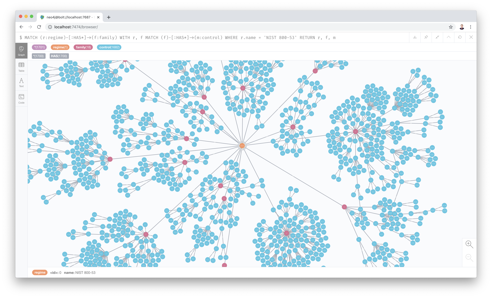
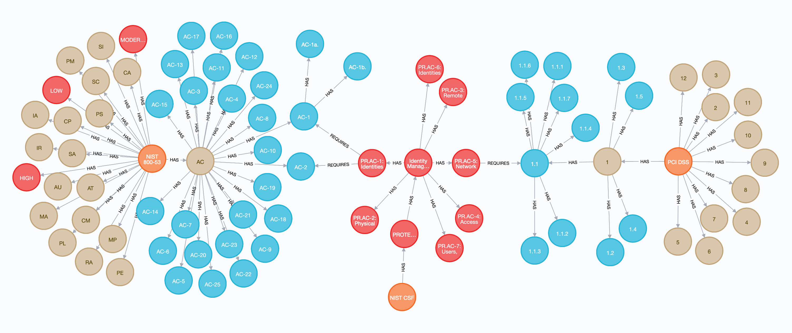
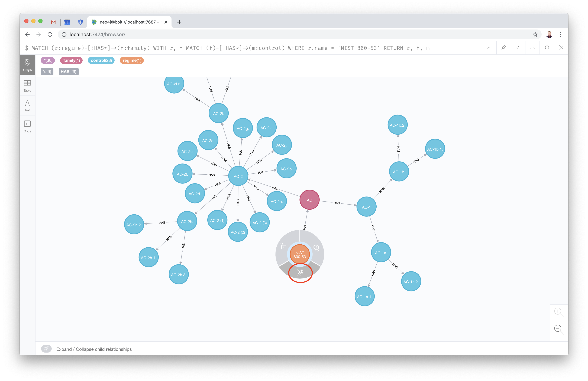
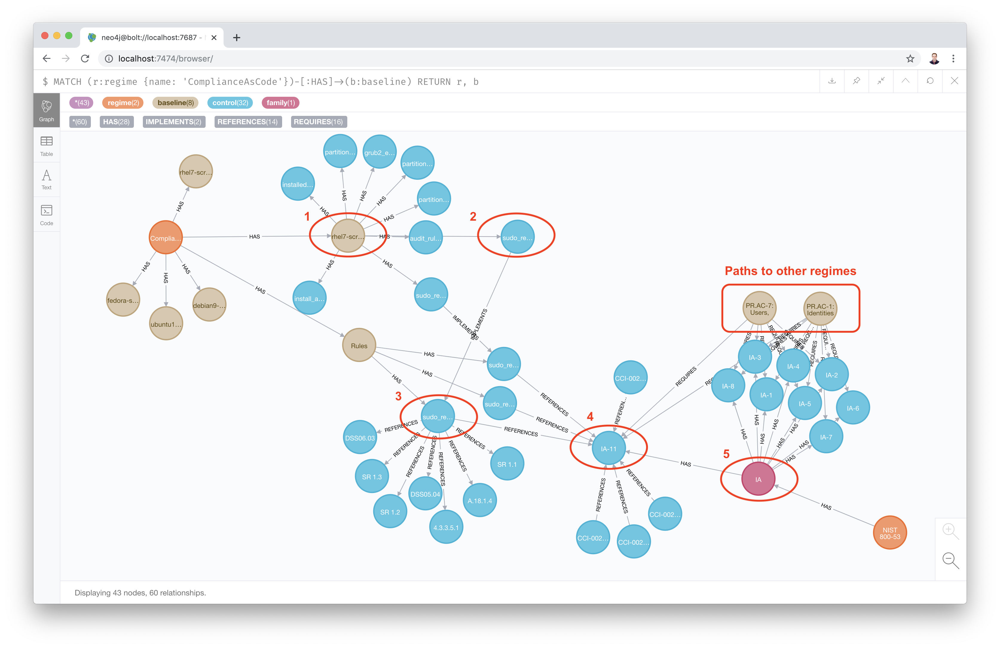

# Security Control Knowledge Graph (sckg)



This project builds a knowledge graph of security compliance regimes, their controls, and how they relate to each other.



The goal of this project is not to create yet-another-compliance-regime, but instead to create a meta-regime of all known publicly accessible regimes. In doing so, and by deriving new insights into those regimes and their relationships, we hope to advance the state of IA compliance by making it less onerous and more impactful to functional security.

## Getting started

### Clone

First, clone this repo to your desktop.

```bash
git clone https://github.com/redteam-project/sckg
cd sckg
```

### Database setup
Currently, this project supports only Neo4j as the backend graph database. The next step to building your own sckg is to [download and install Neo4j Desktop](https://neo4j.com/download/).

[Create a database](https://neo4j.com/developer/neo4j-desktop/#desktop-create-db) and start it.

Once installed, make a file called `neo4j.yml` in a directory called `secrets` and populate it with the connection details for your neo4j database.

```bash
mkdir secrets
cat <<EOF >secrets/neo4j.yml
---
url: bolt://localhost:7687
username: neo4j
password: FILLMEIN
EOF
```

### Loading from a dump

The fastest way to get up and running is to load from one of the included database dumps. Use the `neo4j-admin` command to load a dump from the [data/dumps](data/dumps) directory. 

Refer to the `neo4j-admin load` [example](https://neo4j.com/docs/operations-manual/current/tools/dump-load/) in the Neo4j docs.

### Tabular query output

If you don't want to bother with running a local graph, you can just look through our tabular query output. Here are some that might interest you. Note that we're using the [RHEL 7 STIG Bash script](data/compliance_as_code/build/bash/rhel7-script-stig.sh) as it's one of the most complete.

* By regime
  * [NIST 800-53 to PCI DSS](data/query_output/by_regime/nist_to_pcidss.csv). Generated by:
    ```cypher
    MATCH (csf:regime {name: 'NIST CSF'})-[:HAS*]-(b:baseline)
    WITH b
    MATCH (nist:regime {name: 'NIST 800-53'})-[:HAS*]->(nc:control)
    WITH b, nc
    MATCH (pci:regime {name: 'PCI DSS'})-[:HAS*]->(pc:control)
    WITH b, nc, pc
    MATCH (b)-[:REQUIRES]->(nc), (b)-[:REQUIRES]->(pc)
    RETURN nc.name AS NIST, pc.name AS PCI ORDER BY PCI
    ```
  * [FedRAMP High to PCI DSS](data/query_output/by_regime/fedramphigh_to_pcidss.csv). Generated by:
    ```cypher
    MATCH (:regime {name: 'FedRAMP'})-[:HAS]->(high:baseline {name: 'High'})
    WITH high
    MATCH (csf:regime {name: 'NIST CSF'})-[:HAS*]-(b:baseline)
    WITH high, b
    MATCH (nist:regime {name: 'NIST 800-53'})-[:HAS*]->(nc:control)
    WITH high, b, nc
    MATCH (pci:regime {name: 'PCI DSS'})-[:HAS*]->(pc:control)
    WITH high, b, nc, pc
    MATCH (high)-[:REQUIRES]->(nc), (b)-[:REQUIRES]->(nc), (b)-[:REQUIRES]->(pc)
    RETURN nc.name AS FedRAMP_High, pc.name AS PCI ORDER BY PCI
    ```
  * [NIST 800-53 to CJIS](data/query_output/by_regime/nist_to_cjis.csv). Note that this uses Compliance As Code implementations as the paths between regimes, so it may not be exhaustive. Generated by:
    ```cypher
    MATCH (cac:regime {name: 'ComplianceAsCode'})-[:HAS*]->(step:control)
    WITH step
    MATCH (nist:regime {name: 'NIST 800-53'})-[:HAS*]->(nc:control)
    WITH step, nc
    MATCH (cjis:regime {name: 'CJIS'})-[:HAS*]->(cc:control)
    WITH step, nc, cc
    MATCH (step)-[*..4]->(cc) 
    WITH step, nc, cc 
    MATCH (step)-[*..4]->(nc)
    RETURN DISTINCT nc.name AS NIST, cc.name AS CJIS ORDER BY CJIS
    ```
* By OS
  * [RHEL 7 STIG to all regimes and controls](data/query_output/by_os/rhel7_stig_to_all.csv). Generated by:
    ```cypher
    MATCH (bash:baseline {name: 'rhel7-script-stig.sh'})-[:HAS]->(step:control) 
    WITH step 
    MATCH (r:regime)-[:HAS*]->(control:control) 
    WITH step, r, control 
    MATCH (step)-[*..4]->(control)
    RETURN step.name AS Step, collect(distinct(r.name)) AS Regimes, collect(distinct(control.name)) AS Controls
    ```
  * [RHEL 7 STIG to PCI DSS](data/query_output/by_os/rhel7_stig_to_pcidss.csv). Generated by:
    ```cypher
    MATCH (bash:baseline {name: 'rhel7-script-stig.sh'})-[:HAS]->(step:control)
    WITH step
    MATCH (csf:regime {name: 'NIST CSF'})-[:HAS*]-(b:baseline)
    WITH step, b
    MATCH (nist:regime {name: 'NIST 800-53'})-[:HAS*]->(nc:control)
    WITH step, b, nc
    MATCH (pci:regime {name: 'PCI DSS'})-[:HAS*]->(pc:control)
    WITH step, b, nc, pc
    MATCH (step)-[*..4]->(nc), (b)-[:REQUIRES]->(nc), (b)-[:REQUIRES]->(pc)
    RETURN step.name AS Step, nc.name AS NIST, pc.name AS PCI ORDER BY PCI
    ```
  * [RHEL 7 STIG to CJIS](data/query_output/by_os/rhel7_stig_to_cjis.csv). Generated by:
    ```cypher
    MATCH (bash:baseline {name: 'rhel7-script-stig.sh'})-[:HAS]->(step:control)
    WITH step
    MATCH (nist:regime {name: 'NIST 800-53'})-[:HAS*]->(nc:control)
    WITH step, nc
    MATCH (cjis:regime {name: 'CJIS'})-[:HAS*]->(cc:control)
    WITH step, nc, cc
    MATCH (step)-[*..4]->(cc) WITH step, nc, cc MATCH (step)-[*..4]->(nc)
    RETURN step.name as Step, nc.name AS NIST, cc.name AS CJIS ORDER BY CJIS
    ```

### Building the graph from scratch

To build your own graph from scratch, ensure your Neo4j database is running, install the dependencies, then call `build.py`.

Note that this project requires Python 3.

```bash
virtualenv venv
source venv/bin/activate
pip install -r requirements
python build.py
```

This can take a while. With this version of sckg there are almost 10,000 nodes and almost 50,000 relationships. While this is small in terms of what Neo4j is capable of hosting, `build.py` is doing a lot of I/O and string operations. Progress will be printed to stdout.

## Queries

Once your graph is built you can start querying it in order to plumb the depths of security control regime interrelatedness.

See the [queries doc](docs/QUERIES.md] for more advanced queries.

### Keeping your browser from melting your laptop

The Neo4j Browser isn't designed to visualize large graphs. You can adjust the `initialNodeConfig` and `maxNeighbours` to adjust how much of the graph gets displayed after a query. We recommend erring on the side of caution here because you can quickly make the Browser unusable with too many displayed nodes and relationships.

Recommended settings:

```
:config initialNodeDisplay: 30
:config maxNeighbours: 50
```

### Example queries

#### Visualize NIST 800-53

```cypher
MATCH (r:regime)-[:HAS*]->(f:family) WITH r, f MATCH (f)-[:HAS*]->(m:control) WHERE r.name = 'NIST 800-53' RETURN r, f, m
```

Note that if you want to explore the graph, click on a node and select the "Expand / Collapse" button that appears below the node.



#### Visualize FedRAMP High and its associated NIST 800-53 controls

```cypher
MATCH (nist:regime {name: 'NIST 800-53'})-[:HAS]->(family:family)
WITH nist, family
MATCH (family)-[:HAS*]->(nistcontrol:control)
WITH nist, family, nistcontrol
MATCH (fedramp:regime {name: 'FedRAMP'})-[:HAS]->(baseline:baseline {name: 'High'})
WITH nist, family, nistcontrol, fedramp, baseline
MATCH (baseline)-[:REQUIRES]->(nistcontrol)
RETURN nist, family, nistcontrol, fedramp, baseline
```

It's fun to visualize and explore the graph, but this query is a good example of a query that's better when it returns tabular data. Simply add the attribute of the nodes that you want returned, for example:

```cypher
MATCH (nist:regime {name: 'NIST 800-53'})-[:HAS]->(family:family)
WITH nist, family
MATCH (family)-[:HAS*]->(nistcontrol:control)
WITH nist, family, nistcontrol
MATCH (fedramp:regime {name: 'FedRAMP'})-[:HAS]->(baseline:baseline {name: 'High'})
WITH nist, family, nistcontrol, fedramp, baseline
MATCH (baseline)-[:REQUIRES]->(nistcontrol)
RETURN nist.name, family.name, nistcontrol.name, fedramp.name, baseline.name ORDER BY nistcontrol.name
``` 

#### Which NIST 800-53 controls are satisified by Compliance as Code's RHEL 7 STIG script?

This project is tracking the [Compliance as Code](https://github.com/complianceascode/content) implementations of security complaince controls. Note that the generation of the scripts requires a build, see the [data README](data/compliance_as_code/README.md) for details on how to recreate the scripts in the [build](data/compliance_as_code/build) directory.

First, explore the scripts in this version of the graph.

```cypher
MATCH (r:regime {name: 'ComplianceAsCode'})-[:HAS]->(b:baseline) 
WHERE b.name ENDS WITH '.sh' 
RETURN b.name
```

The Neo4j Browser can be useful for learning which paths can be used to find what you're looking for. Change the above query to `RETURN r, b` and explore the graph to find a path from the steps under the desired script, in this case `rhel7-script-stig.sh`, to the desired regime. For example:



In this case there's a direct path to NIST 800-53. Getting to other regimes can require a more complex path through a baseline like NIST CSF, also identified above.

```cypher
MATCH (bash:baseline {name: 'rhel7-script-stig.sh'})-[:HAS]->(step:control)
WITH step
MATCH (nist:regime {name: 'NIST 800-53'})-[:HAS*]->(nc:control)
WITH step, nc
MATCH (step)-[*..4]->(nc)
RETURN step.name AS Step, nc.name AS NIST ORDER BY NIST
```

Now the more complicated example: let's find out which PCI DSS controls are satisfied by this STIG script. We'll have to use the NIST CSF path identified above.

```cypher
MATCH (bash:baseline {name: 'rhel7-script-stig.sh'})-[:HAS]->(step:control)
WITH step
MATCH (csf:regime {name: 'NIST CSF'})-[:HAS*]-(b:baseline)
WITH step, b
MATCH (nist:regime {name: 'NIST 800-53'})-[:HAS*]->(nc:control)
WITH step, b, nc
MATCH (pci:regime {name: 'PCI DSS'})-[:HAS*]->(pc:control)
WITH step, b, nc, pc
MATCH (step)-[*..4]->(nc), (b)-[:REQUIRES]->(nc), (b)-[:REQUIRES]->(pc)
RETURN step.name AS Step, nc.name AS NIST, pc.name AS PCI ORDER BY PCI
```

#### Identify FedRAMP High overlap with PCI DSS

An even more complicated example: If you've already met the requirements for FedRAMP High on RHEL 7, which PCI DSS requirements have you also met?

```cypher
MATCH (bash:baseline {name: 'rhel7-script-stig.sh'})-[:HAS]->(step:control)
WITH step
MATCH (csf:regime {name: 'NIST CSF'})-[:HAS*]-(b:baseline)
WITH step, b
MATCH (nist:regime {name: 'NIST 800-53'})-[:HAS*]->(nc:control)
WITH step, b, nc
MATCH (fedramp:regime {name: 'FedRAMP'})-[:HAS]->(high:baseline {name: 'High'})
WITH step, b, nc, fedramp
MATCH (pci:regime {name: 'PCI DSS'})-[:HAS*]->(pc:control)
WITH step, b, nc, fedramp, pc
MATCH (step)-[*..4]->(nc), (b)-[:REQUIRES]->(nc), (high)-[:REQUIRES]->(nc), (b)-[:REQUIRES]->(pc)
RETURN step.name AS Step, nc.name AS NIST, pc.name AS PCI ORDER BY PCI
``` 

## Getting involved

Want to get involved with this project? There are lots of ways to help!

Refer to the [CONTRIBUTING](CONTRIBUTING.md) page.

